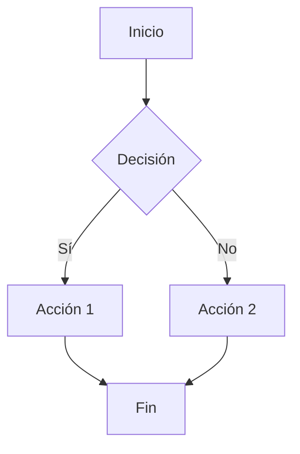
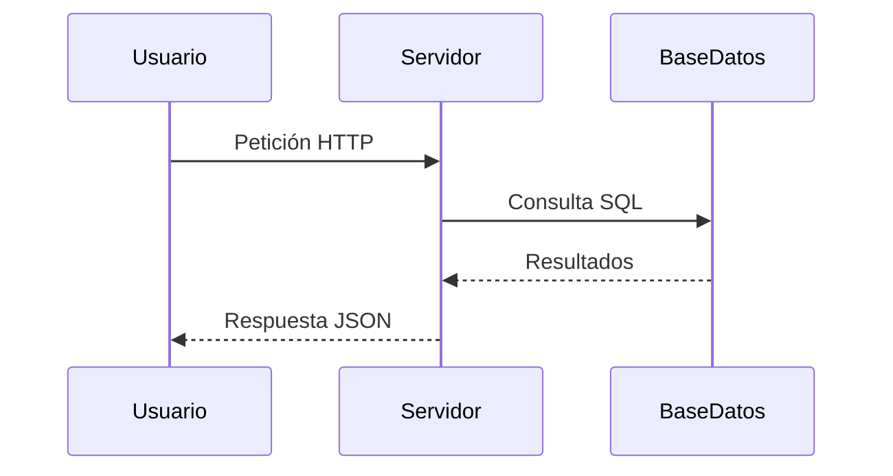
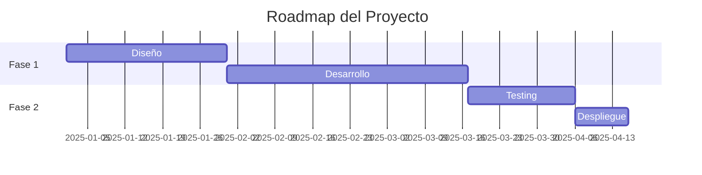
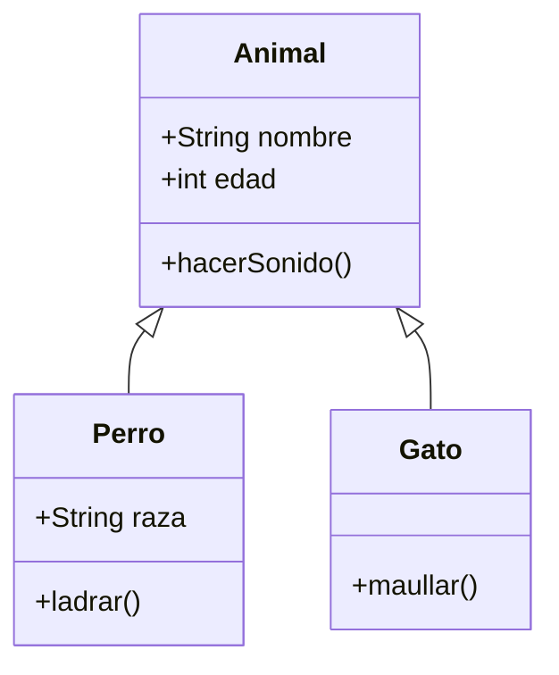

# Awesome README Guide ES

[](https://opensource.org/licenses/MIT)
[](http://makeapullrequest.com)
[](https://github.com/hugooae/Awesome-README-Guide/stargazers)

> Una guía completa y práctica para crear archivos README.md excepcionales que hagan brillar tus proyectos. Aprende todos los componentes, técnicas y mejores prácticas para documentar profesionalmente.

[Ver Ejemplos](#ejemplos-por-tipo-de-proyecto) • [Documentación](#componentes-esenciales) • [Contribuir](#cómo-contribuir) • [Recursos](#recursos-adicionales)

---

## Tabla de Contenidos

- [¿Por qué este repositorio?](#por-qué-este-repositorio)
- [Componentes esenciales](#componentes-esenciales)
- [Alertas y avisos especiales](#alertas-y-avisos-especiales)
- [Badges y escudos](#badges-y-escudos)
- [Tablas](#tablas)
- [Listas de tareas](#listas-de-tareas)
- [Ejemplos por tipo de proyecto](#ejemplos-por-tipo-de-proyecto)
- [Herramientas útiles](#herramientas-útiles)
- [Checklist del README perfecto](#checklist-del-readme-perfecto)
- [Cómo contribuir](#cómo-contribuir)
- [Licencia](#licencia)

---

## ¿Por qué este repositorio?

Un buen README es la primera impresión de tu proyecto. Es la diferencia entre que alguien use tu código o lo ignore por completo.

### Estadísticas importantes

- Los proyectos con README completos reciben 30% más estrellas en GitHub
- El 90% de los usuarios abandonan un proyecto sin documentación clara
- Un README bien estructurado reduce las preguntas frecuentes en un 60%

### Lo que encontrarás aquí

- Todos los componentes de un README profesional con ejemplos visuales
- Comparación lado a lado de "código vs resultado"
- Mejores prácticas usadas por proyectos populares
- Herramientas para automatizar y mejorar tu documentación
- Plantillas listas para usar según tu tipo de proyecto

---

## Componentes Esenciales

### 1. Título y Descripción

#### Cómo se escribe:
```markdown
# Nombre del Proyecto

[](https://opensource.org/licenses/MIT)
[]()

Una descripción concisa de una línea que explica qué hace tu proyecto.

Una descripción más detallada (2-3 párrafos) que expanda sobre el problema 
que resuelve, para quién está diseñado, y qué lo hace único o diferente 
de alternativas existentes.
```

#### Cómo se ve:

# Nombre del Proyecto

[](https://opensource.org/licenses/MIT)
[]()

Una descripción concisa de una línea que explica qué hace tu proyecto.

Una descripción más detallada (2-3 párrafos) que expanda sobre el problema que resuelve, para quién está diseñado, y qué lo hace único o diferente de alternativas existentes.

---

### 2. Badges y Escudos

#### Cómo se escribe:
```markdown


```

#### Cómo se ve:


**Genera tus badges en:** [shields.io](https://shields.io/)

**Categorías comunes:**
- Estado de construcción y tests
- Cobertura de código
- Versión y descargas
- Licencia
- Dependencias actualizadas
- Calidad de código

---

### 3. Enlaces rápidos

#### Cómo se escribe:
```markdown
[Documentación](https://docs.example.com) • 
[Demo en vivo](https://demo.example.com) • 
[Reportar Bug](https://github.com/hugooae/Awesome-README-Guide/issues) • 
[Solicitar Feature](https://github.com/hugooae/Awesome-README-Guide/issues)
```

#### Cómo se ve:

[Documentación](https://docs.example.com) • [Demo en vivo](https://demo.example.com) • [Reportar Bug](https://github.com/hugooae/Awesome-README-Guide/issues) • [Solicitar Feature](https://github.com/hugooae/Awesome-README-Guide/issues)

---

### 4. Tabla de Contenidos

#### Cómo se escribe:
```markdown
## Tabla de Contenidos

- [Instalación](#instalación)
- [Uso](#uso)
- [API](#api)
- [Ejemplos](#ejemplos)
- [Contribuir](#contribuir)
- [Licencia](#licencia)
```

#### Cómo se ve:

## Tabla de Contenidos

- [Instalación](#instalación)
- [Uso](#uso)
- [API](#api)
- [Ejemplos](#ejemplos)
- [Contribuir](#contribuir)
- [Licencia](#licencia)

---

### 5. Características Principales

#### Cómo se escribe:
```markdown
## Características

- **Rendimiento optimizado** - Arquitectura diseñada para máxima eficiencia
- **Ligero** - Solo 5kb minificado y gzipped
- **Altamente personalizable** - Sistema de configuración flexible
- **Seguro** - Implementa las mejores prácticas de seguridad
- **Bien documentado** - Documentación completa con ejemplos
- **Probado exhaustivamente** - Cobertura de tests superior al 90%
```

#### Cómo se ve:

## Características

- **Rendimiento optimizado** - Arquitectura diseñada para máxima eficiencia
- **Ligero** - Solo 5kb minificado y gzipped
- **Altamente personalizable** - Sistema de configuración flexible
- **Seguro** - Implementa las mejores prácticas de seguridad
- **Bien documentado** - Documentación completa con ejemplos
- **Probado exhaustivamente** - Cobertura de tests superior al 90%

---

### 6. Instalación

#### Cómo se escribe:
````markdown
## Instalación

### Requisitos previos

- Node.js >= 16.0.0
- npm >= 8.0.0

### Instalación vía npm

```bash
npm install nombre-paquete
```

### Instalación desde el código fuente

```bash
git clone https://github.com/hugooae/Awesome-README-Guide.git
cd Awesome-README-Guide
npm install
npm run build
```
````

#### Cómo se ve:

## Instalación

### Requisitos previos

- Node.js >= 16.0.0
- npm >= 8.0.0

### Instalación vía npm

```bash
npm install nombre-paquete
```

### Instalación desde el código fuente

```bash
git clone https://github.com/hugooae/Awesome-README-Guide.git
cd Awesome-README-Guide
npm install
npm run build
```

---

### 7. Uso Básico

#### Cómo se escribe:
````markdown
## Uso

### Ejemplo básico

```javascript
const { Libreria } = require('nombre-paquete');

const instancia = new Libreria({
  apiKey: 'tu_clave_aqui',
  timeout: 3000
});

const resultado = await instancia.metodo();
console.log(resultado);
```
````

#### Cómo se ve:

## Uso

### Ejemplo básico

```javascript
const { Libreria } = require('nombre-paquete');

const instancia = new Libreria({
  apiKey: 'tu_clave_aqui',
  timeout: 3000
});

const resultado = await instancia.metodo();
console.log(resultado);
```

---

### 8. Documentación de API

#### Cómo se escribe:
````markdown
## API

### `metodo(parametro)`

Descripción detallada del método.

**Parámetros:**
- `parametro` (string): Descripción del parámetro

**Retorna:** Promise<Object> - Objeto con la respuesta

**Ejemplo:**
```javascript
const resultado = await lib.metodo('valor');
```
````

#### Cómo se ve:

## API

### `metodo(parametro)`

Descripción detallada del método.

**Parámetros:**
- `parametro` (string): Descripción del parámetro

**Retorna:** Promise<Object> - Objeto con la respuesta

**Ejemplo:**
```javascript
const resultado = await lib.metodo('valor');
```

---

## Alertas y Avisos Especiales

GitHub y GitLab soportan alertas especiales con formato destacado.

### Tipos de alertas

#### Cómo se escribe:
```markdown
> [!NOTE]
> Información útil que los usuarios deben conocer, incluso al ojear el contenido.

> [!TIP]
> Consejos útiles para hacer las cosas mejor o más fácilmente.

> [!IMPORTANT]
> Información clave que los usuarios necesitan conocer para alcanzar su objetivo.

> [!WARNING]
> Información urgente que necesita atención inmediata del usuario para evitar problemas.

> [!CAUTION]
> Advierte sobre riesgos o resultados negativos de ciertas acciones.
```

#### Cómo se ve:

> [!NOTE]
> Información útil que los usuarios deben conocer, incluso al ojear el contenido.

> [!TIP]
> Consejos útiles para hacer las cosas mejor o más fácilmente.

> [!IMPORTANT]
> Información clave que los usuarios necesitan conocer para alcanzar su objetivo.

> [!WARNING]
> Información urgente que necesita atención inmediata del usuario para evitar problemas.

> [!CAUTION]
> Advierte sobre riesgos o resultados negativos de ciertas acciones.

### Ejemplos prácticos de alertas

#### Cómo se escribe:
```markdown
> [!WARNING]
> Este software no ha recibido revisión de seguridad externa y puede contener 
> vulnerabilidades. No lo uses para casos sensibles hasta que haya sido auditado.

> [!IMPORTANT]
> La versión 2.0 introduce cambios incompatibles. Lee la [guía de migración](MIGRATION.md) 
> antes de actualizar.

> [!TIP]
> Puedes acelerar el proceso usando el flag `--fast` en el comando de instalación.
```

#### Cómo se ve:

> [!WARNING]
> Este software no ha recibido revisión de seguridad externa y puede contener vulnerabilidades. No lo uses para casos sensibles hasta que haya sido auditado.

> [!IMPORTANT]
> La versión 2.0 introduce cambios incompatibles. Lee la [guía de migración](MIGRATION.md) antes de actualizar.

> [!TIP]
> Puedes acelerar el proceso usando el flag `--fast` en el comando de instalación.

---

## Tablas

Las tablas son útiles para mostrar configuraciones, opciones o comparaciones.

#### Cómo se escribe:
```markdown
| Opción | Tipo | Por defecto | Descripción |
|--------|------|-------------|-------------|
| `apiKey` | string | - | Clave de API requerida |
| `port` | number | 3000 | Puerto del servidor |
| `debug` | boolean | false | Activar modo debug |
| `timeout` | number | 5000 | Timeout en milisegundos |
```

#### Cómo se ve:

| Opción | Tipo | Por defecto | Descripción |
|--------|------|-------------|-------------|
| `apiKey` | string | - | Clave de API requerida |
| `port` | number | 3000 | Puerto del servidor |
| `debug` | boolean | false | Activar modo debug |
| `timeout` | number | 5000 | Timeout en milisegundos |

### Alineación en tablas

#### Cómo se escribe:
```markdown
| Izquierda | Centro | Derecha |
|:----------|:------:|--------:|
| Texto     | Texto  | Texto   |
| Más texto | Más    | Más     |
```

#### Cómo se ve:

| Izquierda | Centro | Derecha |
|:----------|:------:|--------:|
| Texto     | Texto  | Texto   |
| Más texto | Más    | Más     |

---

## Listas de Tareas

Útiles para roadmaps y checklists.

#### Cómo se escribe:
```markdown
## Roadmap

### Completado
- [x] Funcionalidad básica
- [x] Documentación completa
- [x] Tests unitarios

### En progreso
- [ ] Mejoras de rendimiento
- [ ] Plugin system

### Planeado
- [ ] Soporte para TypeScript
- [ ] CLI mejorado
```

#### Cómo se ve:

## Roadmap

### Completado
- [x] Funcionalidad básica
- [x] Documentación completa
- [x] Tests unitarios

### En progreso
- [ ] Mejoras de rendimiento
- [ ] Plugin system

### Planeado
- [ ] Soporte para TypeScript
- [ ] CLI mejorado

---

## Bloques de Código

### Código con sintaxis específica

#### Cómo se escribe:
````markdown
```javascript
function ejemplo() {
  console.log("Hola mundo");
  return true;
}
```

```python
def ejemplo():
    print("Hola mundo")
    return True
```

```bash
npm install
npm test
```
````

#### Cómo se ve:

```javascript
function ejemplo() {
  console.log("Hola mundo");
  return true;
}
```

```python
def ejemplo():
    print("Hola mundo")
    return True
```

```bash
npm install
npm test
```

### Código inline

#### Cómo se escribe:
```markdown
Ejecuta el comando `npm install` para instalar las dependencias.
La función `obtenerDatos()` retorna un objeto con los resultados.
```

#### Cómo se ve:

Ejecuta el comando `npm install` para instalar las dependencias.
La función `obtenerDatos()` retorna un objeto con los resultados.

---

## Citas y Callouts

#### Cómo se escribe:
```markdown
> Esta es una cita normal que puede usarse para destacar información.

> Puedes usar citas para incluir testimonios de usuarios o 
> fragmentos importantes de documentación externa.
```

#### Cómo se ve:

> Esta es una cita normal que puede usarse para destacar información.

> Puedes usar citas para incluir testimonios de usuarios o fragmentos importantes de documentación externa.

---

## Enlaces e Imágenes

### Enlaces básicos

#### Cómo se escribe:
```markdown
[Texto del enlace](https://ejemplo.com)
[Documentación oficial](https://docs.ejemplo.com)
[Ver en GitHub](https://github.com/hugooae/Awesome-README-Guide)
```

#### Cómo se ve:

[Texto del enlace](https://ejemplo.com)
[Documentación oficial](https://docs.ejemplo.com)
[Ver en GitHub](https://github.com/hugooae/Awesome-README-Guide)

### Enlaces con referencia

#### Cómo se escribe:
```markdown
Este es un [enlace con referencia][1] y este es [otro enlace][2].

[1]: https://ejemplo.com
[2]: https://docs.ejemplo.com
```

#### Cómo se ve:

Este es un [enlace con referencia][1] y este es [otro enlace][2].

[1]: https://ejemplo.com
[2]: https://docs.ejemplo.com

### Imágenes

#### Cómo se escribe:
```markdown


Imagen con enlace:
[](https://ejemplo.com)
```

#### Cómo se ve:


Imagen con enlace:
[](https://ejemplo.com)

### Imagen centrada

#### Cómo se escribe:
```markdown
<p align="center">
  
</p>
```

#### Cómo se ve:

<p align="center">
  
</p>

---

## Formato de Texto

#### Cómo se escribe:
```markdown
**Texto en negrita**
*Texto en cursiva*
***Texto en negrita y cursiva***
~~Texto tachado~~
`Código inline`

Puedes combinar **negrita con *cursiva* dentro**.
```

#### Cómo se ve:

**Texto en negrita**
*Texto en cursiva*
***Texto en negrita y cursiva***
~~Texto tachado~~
`Código inline`

Puedes combinar **negrita con *cursiva* dentro**.

---

## Listas

### Listas desordenadas

#### Cómo se escribe:
```markdown
- Primer elemento
- Segundo elemento
- Tercer elemento
  - Sub-elemento 1
  - Sub-elemento 2
    - Sub-sub-elemento
```

#### Cómo se ve:

- Primer elemento
- Segundo elemento
- Tercer elemento
  - Sub-elemento 1
  - Sub-elemento 2
    - Sub-sub-elemento

### Listas ordenadas

#### Cómo se escribe:
```markdown
1. Primer paso
2. Segundo paso
3. Tercer paso
   1. Sub-paso A
   2. Sub-paso B
4. Cuarto paso
```

#### Cómo se ve:

1. Primer paso
2. Segundo paso
3. Tercer paso
   1. Sub-paso A
   2. Sub-paso B
4. Cuarto paso

---

## Líneas Horizontales

#### Cómo se escribe:
```markdown
Texto antes de la línea

---

Texto después de la línea

***

Otra forma de hacer líneas

___

Y una más
```

#### Cómo se ve:

Texto antes de la línea

---

Texto después de la línea

***

Otra forma de hacer líneas

___

Y una más

---

## Detalles Desplegables (Collapsible)

Útil para ocultar información extensa.

#### Cómo se escribe:
```markdown
<details>
<summary>Click para expandir</summary>

### Contenido oculto

Este contenido estará oculto hasta que el usuario haga click.

Puedes incluir:
- Listas
- Código
- Imágenes
- Cualquier contenido Markdown

```javascript
console.log("Código dentro del desplegable");
```

</details>
```

#### Cómo se ve:

<details>
<summary>Click para expandir</summary>

### Contenido oculto

Este contenido estará oculto hasta que el usuario haga click.

Puedes incluir:
- Listas
- Código
- Imágenes
- Cualquier contenido Markdown

```javascript
console.log("Código dentro del desplegable");
```

</details>

---

## Secciones Comunes de un README

### Testing

#### Cómo se escribe:
````markdown
## Tests

### Ejecutar tests

```bash
# Todos los tests
npm test

# Con cobertura
npm run test:coverage

# Modo watch
npm run test:watch
```

### Cobertura de código

El proyecto mantiene una cobertura mínima del 80%:
- Statements: 85%
- Branches: 82%
- Functions: 88%
- Lines: 85%
````

#### Cómo se ve:

## Tests

### Ejecutar tests

```bash
# Todos los tests
npm test

# Con cobertura
npm run test:coverage

# Modo watch
npm run test:watch
```

### Cobertura de código

El proyecto mantiene una cobertura mínima del 80%:
- Statements: 85%
- Branches: 82%
- Functions: 88%
- Lines: 85%

---

### Solución de Problemas

#### Cómo se escribe:
```markdown
## Solución de Problemas

### Error: "Module not found"

**Causa:** Las dependencias no están instaladas.

**Solución:**
```bash
rm -rf node_modules
npm install
```

### Error: "Permission denied"

**Causa:** Falta de permisos.

**Solución:**
```bash
sudo npm install -g nombre-paquete
```
```

#### Cómo se ve:

## Solución de Problemas

### Error: "Module not found"

**Causa:** Las dependencias no están instaladas.

**Solución:**
```bash
rm -rf node_modules
npm install
```

### Error: "Permission denied"

**Causa:** Falta de permisos.

**Solución:**
```bash
sudo npm install -g nombre-paquete
```

---

### Contribuir

#### Cómo se escribe:
```markdown
## Contribuir

Las contribuciones son bienvenidas. Por favor:

1. Fork el proyecto
2. Crea tu rama de feature (`git checkout -b feature/AmazingFeature`)
3. Commit tus cambios (`git commit -m 'Add: nueva característica'`)
4. Push a la rama (`git push origin feature/AmazingFeature`)
5. Abre un Pull Request

### Guías de estilo

- Usa commits semánticos: `feat:`, `fix:`, `docs:`
- Escribe tests para nuevas funcionalidades
- Actualiza la documentación

Lee [CONTRIBUTING.md](CONTRIBUTING.md) para más detalles.
```

#### Cómo se ve:

## Contribuir

Las contribuciones son bienvenidas. Por favor:

1. Fork el proyecto
2. Crea tu rama de feature (`git checkout -b feature/AmazingFeature`)
3. Commit tus cambios (`git commit -m 'Add: nueva característica'`)
4. Push a la rama (`git push origin feature/AmazingFeature`)
5. Abre un Pull Request

### Guías de estilo

- Usa commits semánticos: `feat:`, `fix:`, `docs:`
- Escribe tests para nuevas funcionalidades
- Actualiza la documentación

Lee [CONTRIBUTING.md](CONTRIBUTING.md) para más detalles.

---

### Licencia

#### Cómo se escribe:
```markdown
## Licencia

Este proyecto está licenciado bajo la Licencia MIT - ver el archivo [LICENSE](LICENSE) para más detalles.

Copyright (c) 2025 Hugo
```

#### Cómo se ve:

## Licencia

Este proyecto está licenciado bajo la Licencia MIT - ver el archivo [LICENSE](LICENSE) para más detalles.

Copyright (c) 2025 Hugo

---

### Autores y Reconocimientos

#### Cómo se escribe:
```markdown
## Autores

**Hugo** - *Creador y mantenedor* - [@hugooae](https://github.com/hugooae)

### Contribuidores

Gracias a todos los [contribuidores](https://github.com/hugooae/Awesome-README-Guide/contributors) 
que han participado en este proyecto.

## Reconocimientos

- Inspirado por [proyecto-similar](https://github.com/user/proyecto)
- Agradecimientos a la comunidad open source
```

#### Cómo se ve:

## Autores

**Hugo** - *Creador y mantenedor* - [@hugooae](https://github.com/hugooae)

### Contribuidores

Gracias a todos los [contribuidores](https://github.com/hugooae/Awesome-README-Guide/contributors) que han participado en este proyecto.

## Reconocimientos

- Inspirado por [proyecto-similar](https://github.com/user/proyecto)
- Agradecimientos a la comunidad open source

---

## Notas al Pie

Las notas al pie te permiten agregar referencias sin interrumpir el flujo del texto.

#### Cómo se escribe:
```markdown
Este es un texto con una nota al pie[^1] y esta es otra nota[^2].

También puedes usar notas con nombres más descriptivos[^nota-larga].

[^1]: Esta es la primera nota al pie.
[^2]: Esta es la segunda nota al pie.
[^nota-larga]: Esta es una nota al pie con un nombre descriptivo.
    Puedes incluir múltiples párrafos en una nota al pie.
    
    Simplemente indenta los párrafos adicionales.
```

#### Cómo se ve:

Este es un texto con una nota al pie[^1] y esta es otra nota[^2].

También puedes usar notas con nombres más descriptivos[^nota-larga].

[^1]: Esta es la primera nota al pie.
[^2]: Esta es la segunda nota al pie.
[^nota-larga]: Esta es una nota al pie con un nombre descriptivo. Puedes incluir múltiples párrafos en una nota al pie.

---

## Menciones y Referencias

### Mencionar usuarios

#### Cómo se escribe:
```markdown
Gracias a @hugooae por la contribución.
Este bug fue reportado por @usuario123.
```

#### Cómo se ve:

Gracias a @hugooae por la contribución.
Este bug fue reportado por @usuario123.

### Referencias a Issues y Pull Requests

#### Cómo se escribe:
```markdown
Esto soluciona el issue #123
Ver pull request #456
Relacionado con hugooae/otro-repo#789
```

#### Cómo se ve:

Esto soluciona el issue #123
Ver pull request #456
Relacionado con hugooae/otro-repo#789

### Commits

#### Cómo se escribe:
```markdown
Ver commit 16c999e8c71134401a78d4d46435517b2271d6ac
O la versión corta: 16c999e
```

#### Cómo se ve:

Ver commit 16c999e8c71134401a78d4d46435517b2271d6ac
O la versión corta: 16c999e

---

## Diagramas con Mermaid

GitHub soporta diagramas Mermaid directamente en Markdown.

### Diagrama de flujo

#### Cómo se escribe:
````markdown

````

#### Cómo se ve:


### Diagrama de secuencia

#### Cómo se escribe:
````markdown

````

#### Cómo se ve:


### Diagrama de Gantt

#### Cómo se escribe:
````markdown

````

#### Cómo se ve:


### Diagrama de clases

#### Cómo se escribe:
````markdown

````

#### Cómo se ve:


---

## Tablas Avanzadas

### Tabla con saltos de línea

#### Cómo se escribe:
```markdown
| Feature | Descripción |
|---------|-------------|
| Feature 1 | Esta es una descripción larga<br>que ocupa múltiples líneas<br>usando `<br>` |
| Feature 2 | Otra descripción<br>en varias líneas |
```

#### Cómo se ve:

| Feature | Descripción |
|---------|-------------|
| Feature 1 | Esta es una descripción larga<br>que ocupa múltiples líneas<br>usando `<br>` |
| Feature 2 | Otra descripción<br>en varias líneas |

### Tabla con código y enlaces

#### Cómo se escribe:
```markdown
| Método | Descripción | Documentación |
|--------|-------------|---------------|
| `GET /api/users` | Obtener todos los usuarios | [Docs](https://docs.api.com) |
| `POST /api/users` | Crear nuevo usuario | [Docs](https://docs.api.com) |
| `DELETE /api/users/:id` | Eliminar usuario | [Docs](https://docs.api.com) |
```

#### Cómo se ve:

| Método | Descripción | Documentación |
|--------|-------------|---------------|
| `GET /api/users` | Obtener todos los usuarios | [Docs](https://docs.api.com) |
| `POST /api/users` | Crear nuevo usuario | [Docs](https://docs.api.com) |
| `DELETE /api/users/:id` | Eliminar usuario | [Docs](https://docs.api.com) |

---

## Badges Avanzados

### Badges personalizados

#### Cómo se escribe:
```markdown


```

#### Cómo se ve:


### Badges dinámicos de GitHub

#### Cómo se escribe:
```markdown


```

#### Cómo se ve:


### Badges de CI/CD

#### Cómo se escribe:
```markdown


```

#### Cómo se ve:


---

## HTML en Markdown

Puedes usar HTML cuando necesites más control sobre el formato.

### Centrar contenido

#### Cómo se escribe:
```markdown
<div align="center">

# Título Centrado

**Texto en negrita centrado**


</div>
```

#### Cómo se ve:

<div align="center">

# Título Centrado

**Texto en negrita centrado**


</div>

### Imágenes con tamaño personalizado

#### Cómo se escribe:
```markdown


```

#### Cómo se ve:


### Imágenes en línea

#### Cómo se escribe:
```markdown


Este texto aparece al lado de la imagen. Lorem ipsum dolor sit amet, 
consectetur adipiscing elit. Sed do eiusmod tempor incididunt ut labore 
et dolore magna aliqua.

<br clear="left"/>

Texto después de limpiar el float.
```

#### Cómo se ve:


Este texto aparece al lado de la imagen. Lorem ipsum dolor sit amet, consectetur adipiscing elit. Sed do eiusmod tempor incididunt ut labore et dolore magna aliqua.

<br clear="left"/>

Texto después de limpiar el float.

### Detalles con estilo

#### Cómo se escribe:
```markdown
<details>
<summary><strong>📚 Ver más información</strong></summary>
<br>

Contenido con **formato Markdown** completo.

- Lista 1
- Lista 2
- Lista 3

```javascript
const codigo = "también funciona";
```

</details>
```

#### Cómo se ve:

<details>
<summary><strong>📚 Ver más información</strong></summary>
<br>

Contenido con **formato Markdown** completo.

- Lista 1
- Lista 2
- Lista 3

```javascript
const codigo = "también funciona";
```

</details>

---

## Keyboard Keys (Teclas)

Para mostrar combinaciones de teclas de forma visual.

#### Cómo se escribe:
```markdown
Presiona <kbd>Ctrl</kbd> + <kbd>C</kbd> para copiar.

Usa <kbd>Cmd</kbd> + <kbd>V</kbd> para pegar en Mac.

Para guardar: <kbd>Ctrl</kbd> + <kbd>S</kbd>

Atajo rápido: <kbd>Alt</kbd> + <kbd>Shift</kbd> + <kbd>F</kbd>
```

#### Cómo se ve:

Presiona <kbd>Ctrl</kbd> + <kbd>C</kbd> para copiar.

Usa <kbd>Cmd</kbd> + <kbd>V</kbd> para pegar en Mac.

Para guardar: <kbd>Ctrl</kbd> + <kbd>S</kbd>

Atajo rápido: <kbd>Alt</kbd> + <kbd>Shift</kbd> + <kbd>F</kbd>

---

## Emojis

GitHub soporta emojis usando códigos o directamente.

#### Cómo se escribe:
```markdown
:tada: :rocket: :sparkles: :star: :heart: :fire: :zap: :boom:

:white_check_mark: :x: :warning: :bulb: :lock: :key: :mag:

:computer: :iphone: :books: :pencil2: :mailbox: :package:

También puedes usar emojis directamente: 🎉 🚀 ✨ ⭐ ❤️ 🔥
```

#### Cómo se ve:

:tada: :rocket: :sparkles: :star: :heart: :fire: :zap: :boom:

:white_check_mark: :x: :warning: :bulb: :lock: :key: :mag:

:computer: :iphone: :books: :pencil2: :mailbox: :package:

También puedes usar emojis directamente: 🎉 🚀 ✨ ⭐ ❤️ 🔥

**Lista completa:** [GitHub Emoji Cheat Sheet](https://github.com/ikatyang/emoji-cheat-sheet)

---

## Comparación de Código (Diff)

Para mostrar cambios en código.

#### Cómo se escribe:
````markdown
```diff
function ejemplo() {
-  return "versión antigua";
+  return "versión nueva";
}

- código eliminado
+ código añadido
! código modificado
# comentario
```
````

#### Cómo se ve:

```diff
function ejemplo() {
-  return "versión antigua";
+  return "versión nueva";
}

- código eliminado
+ código añadido
! código modificado
# comentario
```

---

## Comentarios Ocultos

Comentarios que no se muestran en el README renderizado.

#### Cómo se escribe:
```markdown
<!-- Este es un comentario que no se verá -->

Este texto sí se ve.

<!-- 
Este es un comentario
de múltiples líneas
que tampoco se verá
-->
```

#### Cómo se ve:

<!-- Este es un comentario que no se verá -->

Este texto sí se ve.

<!-- 
Este es un comentario
de múltiples líneas
que tampoco se verá
-->

---

## Escape de Caracteres Especiales

Cuando necesitas mostrar caracteres especiales literalmente.

#### Cómo se escribe:
```markdown
\* No es una lista
\# No es un título
\[No es un enlace](url)
\`No es código\`

Para mostrar una barra invertida: \\
```

#### Cómo se ve:

\* No es una lista
\# No es un título
\[No es un enlace](url)
\`No es código\`

Para mostrar una barra invertida: \\

---

## Listas de Definición

#### Cómo se escribe:
```markdown
<dl>
<dt>Término 1</dt>
<dd>Definición del término 1</dd>

<dt>Término 2</dt>
<dd>Definición del término 2</dd>

<dt>API</dt>
<dd>Application Programming Interface - Interfaz de programación de aplicaciones</dd>
</dl>
```

#### Cómo se ve:

<dl>
<dt>Término 1</dt>
<dd>Definición del término 1</dd>

<dt>Término 2</dt>
<dd>Definición del término 2</dd>

<dt>API</dt>
<dd>Application Programming Interface - Interfaz de programación de aplicaciones</dd>
</dl>

---

## Secciones con Anclajes Personalizados

#### Cómo se escribe:
```markdown
## Mi Sección {#mi-ancla-personalizada}

Ahora puedes enlazar a esta sección con: [Ir a Mi Sección](#mi-ancla-personalizada)

O en HTML:
<h2 id="seccion-html">Sección con HTML</h2>

Enlace: [Ir a Sección HTML](#seccion-html)
```

#### Cómo se ve:

## Mi Sección {#mi-ancla-personalizada}

Ahora puedes enlazar a esta sección con: [Ir a Mi Sección](#mi-ancla-personalizada)

<h2 id="seccion-html">Sección con HTML</h2>

Enlace: [Ir a Sección HTML](#seccion-html)

---

## Alertas Personalizadas con HTML

#### Cómo se escribe:
```markdown
<table>
<tr>
<td>

**⚠️ ADVERTENCIA**

Este es un mensaje de advertencia personalizado con más control sobre el estilo.

</td>
</tr>
</table>

<table>
<tr>
<td bgcolor="#d1ecf1">

**ℹ️ INFORMACIÓN**

Cuadro de información con fondo de color.

</td>
</tr>
</table>
```

#### Cómo se ve:

<table>
<tr>
<td>

**⚠️ ADVERTENCIA**

Este es un mensaje de advertencia personalizado con más control sobre el estilo.

</td>
</tr>
</table>

<table>
<tr>
<td bgcolor="#d1ecf1">

**ℹ️ INFORMACIÓN**

Cuadro de información con fondo de color.

</td>
</tr>
</table>

---

## Ejemplos por Tipo de Proyecto

Este repositorio incluye plantillas específicas en la carpeta `templates/`:

- **Librerías JavaScript/TypeScript** - [javascript-library.md](templates/javascript-library.md)
- **Librerías Python** - [python-library.md](templates/python-library.md)
- **Aplicaciones Web** - [web-app.md](templates/web-app.md)
- **APIs REST** - [rest-api.md](templates/rest-api.md)
- **Herramientas CLI** - [cli-app.md](templates/cli-app.md)
- **Plugins y Extensiones** - [plugin.md](templates/plugin.md)
- **Proyectos de Machine Learning** - [ml-project.md](templates/ml-project.md)
- **Aplicaciones Móviles** - [mobile-app.md](templates/mobile-app.md)

---

## Herramientas Útiles

### Generadores de README
- **[readme.so](https://readme.so/)** - Editor visual de README
- **[readme-md-generator](https://github.com/kefranabg/readme-md-generator)** - Generador CLI
- **[Make a README](https://www.makeareadme.com/)** - Guía interactiva

### Badges
- **[shields.io](https://shields.io/)** - Generador de badges personalizado
- **[badgen.net](https://badgen.net/)** - Alternativa rápida
- **[forthebadge.com](https://forthebadge.com/)** - Badges creativos

### GIFs y demos
- **[asciinema](https://asciinema.org/)** - Grabar terminal
- **[ScreenToGif](https://www.screentogif.com/)** - Crear GIFs
- **[Carbon](https://carbon.now.sh/)** - Screenshots de código elegantes

### Linters
- **[markdownlint](https://github.com/DavidAnson/markdownlint)** - Linter para Markdown
- **[remark](https://github.com/remarkjs/remark)** - Procesador de Markdown

### Diagramas
- **[Mermaid](https://mermaid.js.org/)** - Diagramas como código
- **[draw.io](https://app.diagrams.net/)** - Editor de diagramas

---

## Checklist del README Perfecto

Usa esta lista para verificar que tu README incluye todo lo esencial:

### Elementos básicos
- [ ] Título claro y descriptivo
- [ ] Descripción concisa del proyecto
- [ ] Badges relevantes (build, version, license)
- [ ] Demo visual (screenshot, GIF o video)
- [ ] Tabla de contenidos

### Información técnica
- [ ] Requisitos del sistema
- [ ] Instrucciones de instalación
- [ ] Guía de configuración
- [ ] Ejemplos de uso básico
- [ ] Documentación de API (si aplica)

### Mantenimiento
- [ ] Guía de contribución
- [ ] Información sobre tests
- [ ] Roadmap o planes futuros
- [ ] Sección de solución de problemas

### Legal
- [ ] Licencia claramente indicada
- [ ] Información de contacto
- [ ] Política de seguridad (si aplica)

---

## Recursos Adicionales

### Guías y artículos
- [Art of README](https://github.com/hackergrrl/art-of-readme) - Filosofía del README
- [Awesome README](https://github.com/matiassingers/awesome-readme) - Colección de buenos READMEs
- [Make a README](https://www.makeareadme.com/) - Guía interactiva

### Ejemplos inspiradores
- [freeCodeCamp](https://github.com/freeCodeCamp/freeCodeCamp)
- [React](https://github.com/facebook/react)
- [VS Code](https://github.com/microsoft/vscode)
- [TensorFlow](https://github.com/tensorflow/tensorflow)

### Markdown
- [GitHub Flavored Markdown Spec](https://github.github.com/gfm/)
- [Markdown Guide](https://www.markdownguide.org/)
- [CommonMark](https://commonmark.org/)

---

## Cómo Contribuir

¿Encontraste algo que falta o que se puede mejorar? Las contribuciones son bienvenidas.

1. Fork este repositorio
2. Crea una rama (`git checkout -b feature/mejora`)
3. Haz commit de tus cambios (`git commit -m 'Add: nueva sección sobre X'`)
4. Push a la rama (`git push origin feature/mejora`)
5. Abre un Pull Request

Por favor, asegúrate de:
- Incluir ejemplos tanto del código como del resultado visual
- Mantener el formato consistente con el resto del documento
- Probar que el Markdown se renderiza correctamente

---

## Licencia

Este proyecto está bajo la Licencia MIT - ver el archivo [LICENSE](LICENSE) para más detalles.

## Autor

Creado y mantenido por **Hugo** - [@hugooae](https://github.com/hugooae)

---

Si esta guía te resulta útil, considera darle una estrella en [GitHub](https://github.com/hugooae/Awesome-README-Guide).
